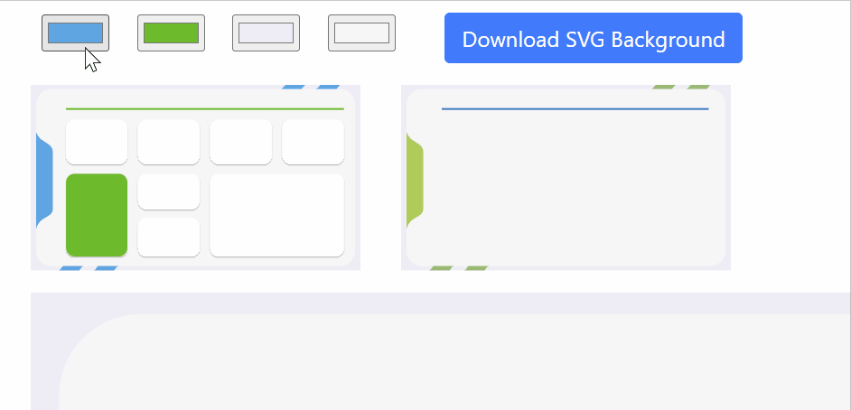

# Free Customized Power BI Backgrounds

This open source project provides a simple and intuitive way to create customized backgrounds for Power BI reports. Users can select from a variety of layouts, choose their preferred color scheme, and download the background for use in their Power BI reports.

[👉 Open Power BI Background Generator 👈](https://zerg00s.github.io/power-bi-backgrounds/index.html)

## Features

- **Customizable Layouts**: Choose from a selection of predefined layouts tailored for Power BI reports.
- **Color Selection**: Customize your background by selecting your preferred color scheme.
- **Free to Use**: All backgrounds generated by this project are free to use in your Power BI reports, whether for personal or commercial use.
- **Easy Download**: With just a click, download your customized background and apply it to your Power BI reports.

## Getting Started

To get started with creating your customized Power BI background, follow these simple steps:

1. Visit our project website.
2. Select a layout that fits your report's style and needs.
3. Choose your color scheme for the background, primary, secondary, and accent colors.
4. Click on the "Download SVG Background" button to download your customized background.
5. Apply the downloaded background to your Power BI report.

## How to Apply Backgrounds in Power BI

After downloading your customized background, you can apply it to your Power BI report by following these steps:

1. Open your Power BI report in Power BI Desktop.
2. Go to the "View" tab and select "Page Background".
3. Click "Add Image" and select the downloaded background file.
4. Adjust the Transparency as needed and apply the background to your report.

## Contributing

We welcome contributions from the community! If you'd like to contribute to this project, please follow these guidelines:

1. Fork the repository.
2. Create a new branch for your feature or fix.
3. Commit your changes with a clear description.
4. Submit a pull request with a detailed description of your changes.

## Support

If you encounter any issues or have suggestions for improvement, please open an issue on our GitHub repository.

## License

This project is open source and available under the [MIT License](LICENSE).

## About

This project was created to support the Power BI community by providing a tool to easily create and customize report backgrounds. We hope it helps you create more engaging and visually appealing reports.

Thank you for using our tool!
